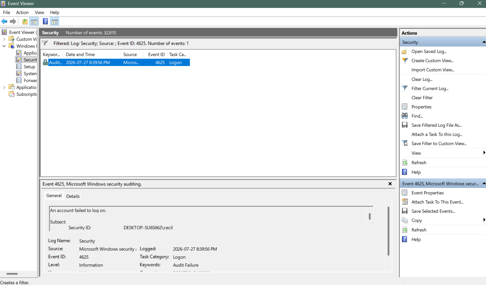
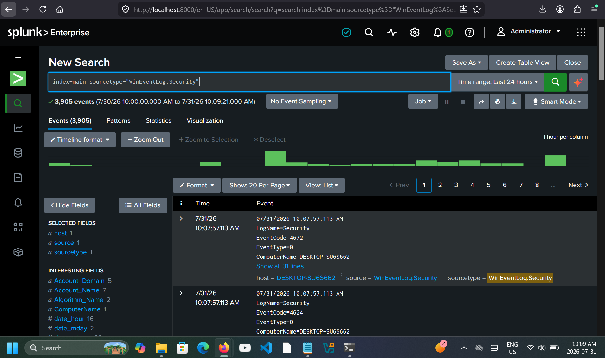
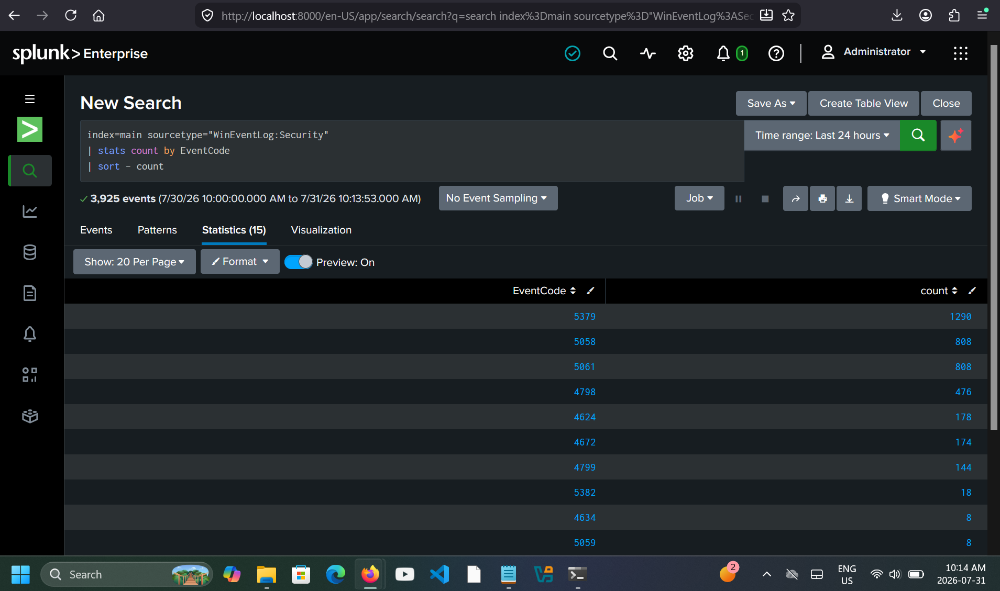
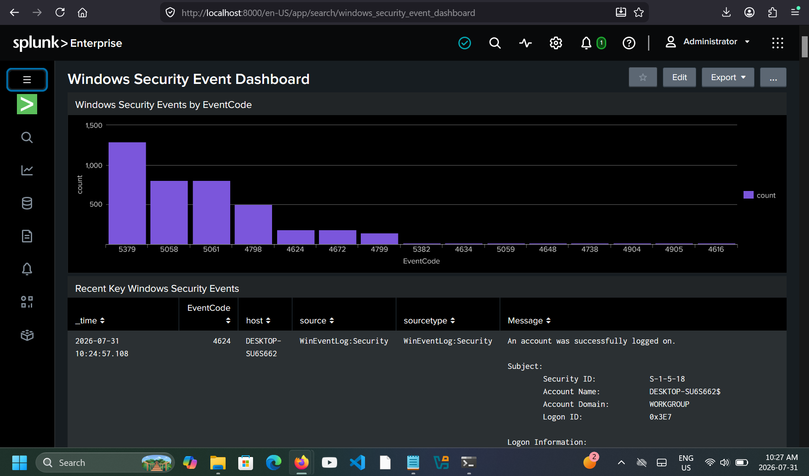
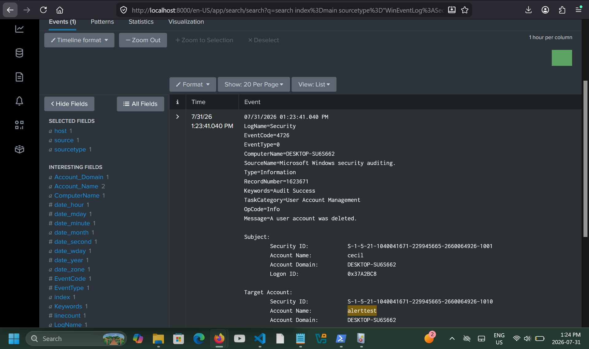
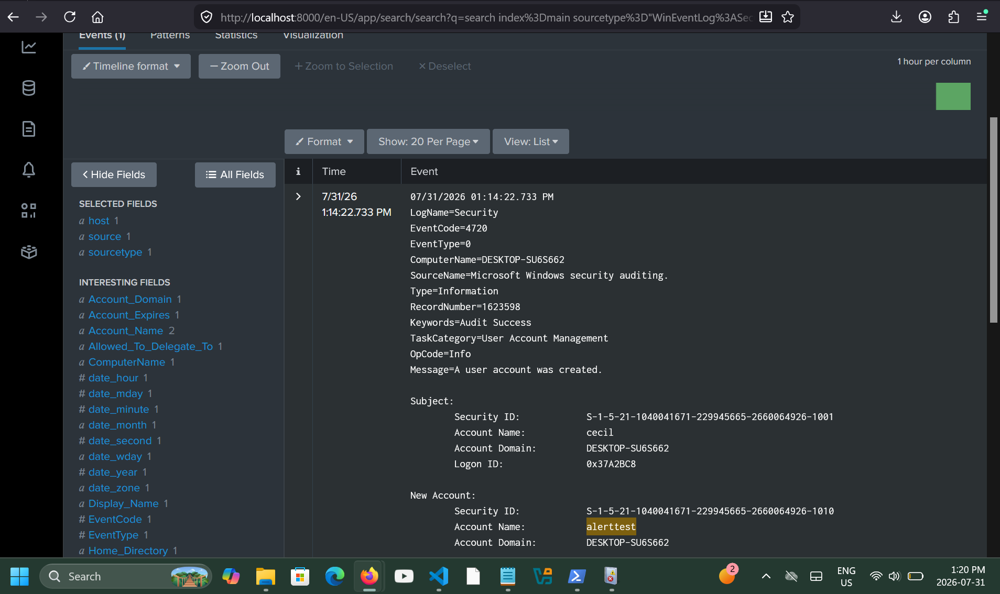
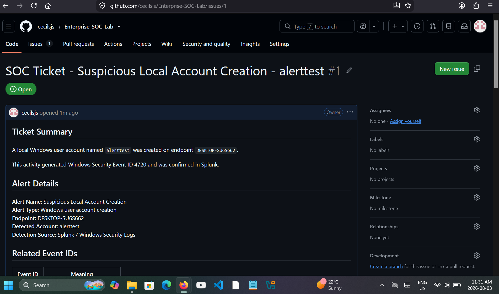

# Enterprise SOC Analyst Lab

A Windows and Splunk-based Security Operations Center (SOC) environment focused on **security-event investigation, SIEM analysis, endpoint alert triage, and incident response workflows**.

The project follows a practical analyst progression:

**Windows Security Telemetry → Event Investigation → Splunk SIEM → Detection & Triage → SOC Ticket → Incident Resolution** 

## Key Security Outcomes

- Investigated Windows authentication and account-security events in Event Viewer
- Analyzed successful and failed logons, including Event IDs `4624` and `4625`
- Reviewed privilege activity, local users, groups, and administrator membership
- Ingested Windows Security logs into Splunk Enterprise
- Used Splunk Search Processing Language (SPL) to analyze Windows security events
- Built a Windows Security monitoring dashboard
- Simulated suspicious local account creation and investigated Event ID `4720`
- Verified subsequent account deletion using Event ID `4726`
- Performed endpoint alert triage with severity, impact, evidence, and disposition
- Created and resolved a SOC-style incident ticket using GitHub Issues
- Preserved investigation evidence across Windows Event Viewer, Splunk, and ticketing workflows

## Investigation Highlight

A controlled endpoint-security scenario simulated the creation of a suspicious local Windows account named `alerttest`.

The activity was investigated across multiple sources:

```text
Suspicious Account Creation
          |
          v
Windows Event ID 4720
          |
          v
Splunk SIEM Detection
          |
          v
Endpoint Alert Triage
          |
          v
Account Deletion - Event ID 4726
          |
          v
SOC Ticket & Final Disposition
```

This workflow demonstrates how a security event can move from raw endpoint telemetry through SIEM investigation, analyst triage, response action, and documented incident closure.

## Technology Stack

`Windows Security Logs` · `Event Viewer` · `Splunk Enterprise` · `SPL` · `PowerShell` · `Windows Local Accounts` · `GitHub Issues` · `MITRE ATT&CK`

---

## Project Goals

The goals of this lab are to:

- Investigate Windows Security logs
- Understand important Windows Event IDs
- Analyze successful and failed logon events
- Review Windows account and privilege activity
- Practice local user and group security review
- Build foundational Active Directory security concepts
- Ingest Windows Security logs into Splunk
- Search Windows logs using SPL
- Create SIEM-style dashboards
- Simulate endpoint alert triage
- Create mock SOC tickets
- Practice evidence collection from Windows, Splunk, and GitHub Issues
- Document investigations clearly for a cybersecurity portfolio

---

## Lab Environment

| Component | Description |
|---|---|
| Host Machine | Windows laptop |
| Log Source | Windows Event Viewer |
| Primary Logs | Windows Security logs |
| SIEM Platform | Splunk Enterprise |
| Ticketing Simulation | GitHub Issues |
| Evidence | Screenshots, copied event details, and triage notes |
| Documentation | GitHub |

--- 

## SOC Investigation Architecture

The Enterprise SOC Lab follows an analyst workflow that moves Windows endpoint telemetry through investigation, SIEM analysis, triage, response, and incident documentation.

```text
Windows Endpoint
      |
      | Windows Security Events
      v
Windows Event Viewer
      |
      | Event IDs / Authentication / Account Activity
      v
Splunk Enterprise
      |
      | SPL Search & Event Analysis
      v
Security Investigation
      |
      | Detection Context / Evidence / Severity
      v
Endpoint Alert Triage
      |
      | Response Action
      v
SOC Ticket
      |
      | Investigation Notes / Disposition
      v
Incident Closure
```

### Security Data Flow

```text
Windows Security Logs
        |
        +-- Event ID 4624  Successful Logon
        +-- Event ID 4625  Failed Logon
        +-- Event ID 4672  Special Privileges
        +-- Event ID 4720  Account Created
        +-- Event ID 4726  Account Deleted
        +-- Event ID 4798  Group Membership Enumerated
        |
        v
Splunk SIEM
        |
        +-- SPL Investigation
        +-- EventCode Aggregation
        +-- Security Dashboard
        |
        v
Analyst Triage
        |
        +-- Evidence Review
        +-- Severity Assessment
        +-- Impact Analysis
        +-- Response Action
        +-- Final Disposition
        |
        v
SOC Ticket & Incident Documentation
```

This architecture demonstrates how endpoint events can be transformed from raw Windows telemetry into searchable SIEM data, analyst investigation, response actions, and documented incident closure.

---

## Completed Projects

| Project | Title | Focus |
|---:|---|---|
| 01 | Windows Event Log Investigation | Event Viewer, Event ID 4624, Event ID 4625, logon types, evidence collection |
| 02 | Windows Account and Security Events | Logoff events, special privileges, user creation, user deletion, account lockout checks |
| 03 | Windows Local Users, Groups, and AD Security Concepts | Local users, groups, administrator membership, enabled/disabled accounts, identity review |
| 04 | Splunk SIEM Windows Log Ingestion and Dashboarding | Splunk installation, Windows Security log ingestion, SPL searches, EventCode counts, dashboard creation |
| 05 | Endpoint Alert Triage | Suspicious account creation simulation, Event Viewer review, Splunk detection, severity, triage notes |
| 06 | Mock Ticketing and Incident Response Workflow | GitHub Issues ticket, timeline, evidence review, resolution comment, final disposition |

---

## Skills Demonstrated

This project demonstrates skills in:

- Windows Event Viewer
- Windows Security logs
- Event ID analysis
- Authentication investigation
- Logon type interpretation
- Windows account activity review
- Local user and group review
- Administrator membership review
- PowerShell basics
- Splunk SIEM log ingestion
- SPL search queries
- Dashboard creation
- Endpoint alert triage
- Severity classification
- SOC ticket documentation
- Evidence collection
- Security documentation
- Incident response workflow
- Analyst investigation notes

---

## Tools Used

| Tool | Purpose |
|---|---|
| Windows Event Viewer | Review Windows Security logs |
| PowerShell | Run Windows account, group, and security investigation commands |
| Splunk Enterprise | Ingest, search, analyze, and visualize Windows Security logs |
| SPL | Search Processing Language used in Splunk searches |
| GitHub Issues | Simulated SOC ticketing workflow |
| Screenshots | Capture investigation evidence |
| GitHub | Document portfolio projects |

---

## Key Windows Event IDs

| Event ID | Meaning |
|---:|---|
| 4624 | An account was successfully logged on |
| 4625 | An account failed to log on |
| 4634 | An account was logged off |
| 4672 | Special privileges assigned to a new logon |
| 4720 | A user account was created |
| 4726 | A user account was deleted |
| 4740 | A user account was locked out |
| 4798 | A user's local group membership was enumerated |

---

## Completed Project Summaries

### Project 01 – Windows Event Log Investigation

In Project 01, I reviewed Windows Security logs using Event Viewer and filtered for Event IDs 4624 and 4625.

I identified:

- Event ID 4624 – Successful logon
- Event ID 4625 – Failed logon
- Logon Type 2 – Interactive logon
- Logon Type 3 – Network logon
- Logon Type 5 – Service logon

I observed a successful service logon by the SYSTEM account and failed logon activity with the reason “unknown username or bad password.”



Windows Event Viewer was used to investigate a failed authentication event and review the security context associated with Event ID `4625`.

This project introduced Windows Event Viewer, Windows Security logs, authentication event analysis, logon types, screenshot evidence, and copied event details.

---

### Project 02 – Windows Account and Security Events

In Project 02, I investigated Windows account and security events using Event Viewer.

I reviewed important Windows Security Event IDs, including:

- Event ID 4634 – An account was logged off
- Event ID 4672 – Special privileges assigned to a new logon
- Event ID 4720 – A user account was created
- Event ID 4726 – A user account was deleted
- Event ID 4740 – A user account was locked out

I safely generated account creation and deletion events by creating and deleting a temporary local test user named:

```text
soclabtest
```

This project helped me understand how Windows records account activity, privilege events, account creation, account deletion, and lockout checks that SOC analysts may investigate.

---

### Project 03 – Windows Local Users, Groups, and Active Directory Security Concepts

In Project 03, I reviewed local Windows users, groups, administrator membership, and identity security concepts.

I used PowerShell commands such as:

```powershell
whoami
whoami /groups
net user
Get-LocalUser
net localgroup
net localgroup Administrators
```

I identified the current Windows user:

```text
DESKTOP-SU6S662\cecil
```

I also confirmed that the local user `cecil` was a member of the local Administrators group.

This project introduced identity review concepts that apply to Active Directory environments, including user accounts, group membership, administrator privileges, enabled and disabled accounts, and access review.

---

### Project 04 – Splunk SIEM Windows Log Ingestion and Dashboarding

In Project 04, I installed Splunk Enterprise on Windows and configured it to ingest local Windows Security logs.

I confirmed that Windows Security events were searchable in Splunk using:

```spl
index=main sourcetype="WinEventLog:Security"
```

I summarized Windows Security events by EventCode using SPL and observed events such as:

- Event ID 4672 – Special privileges assigned to a new logon
- Event ID 4624 – Successful logon
- Event ID 4798 – A user's local group membership was enumerated

I created a Splunk dashboard called:

```text
Windows Security Event Dashboard
```

The dashboard included:

- Windows Security Events by EventCode
- Recent Key Windows Security Events

This project demonstrated a full SIEM-style workflow: ingest logs, search data, summarize events, create dashboards, collect evidence, and document findings.

#### Splunk Investigation Evidence



Windows Security telemetry was ingested into Splunk and searched using SPL to review authentication, privilege, and account-related events.



EventCode aggregation was used to summarize the Windows Security events present in the dataset and identify the most frequently observed event types.



A Windows Security dashboard was created to provide an analyst-facing view of EventCode activity and recent security events.

---

### Project 05 – Endpoint Alert Triage

In Project 05, I simulated an endpoint alert involving suspicious local account creation.

I created a temporary local Windows account named:

```text
alerttest
```

This generated:

- Event ID 4720 – A user account was created

I confirmed the alert in:

- Windows Event Viewer
- Splunk Enterprise

I searched Splunk using:

```spl
index=main sourcetype="WinEventLog:Security" EventCode=4720 alerttest
```

After collecting evidence, I deleted the temporary account and confirmed the deletion event with:

- Event ID 4726 – A user account was deleted

I wrote SOC-style triage notes that included:

- Alert name
- Alert type
- Endpoint
- Detected account
- Related Event IDs
- Detection source
- Severity
- Severity reason
- Impact
- Response action
- Final disposition
- Recommendation

This project demonstrated endpoint alert triage, severity classification, evidence review, and response documentation.

#### Endpoint Alert Triage Evidence



Splunk confirmed Event ID `4720` for the creation of the temporary `alerttest` account, providing SIEM evidence for the simulated endpoint alert.



After investigation and response, Splunk confirmed Event ID `4726`, showing that the `alerttest` account had been deleted.

Together, these events document the alert lifecycle from suspicious account creation through investigation and remediation.

#### MITRE ATT&CK Mapping

The suspicious local account creation behavior was mapped to MITRE ATT&CK based on the Windows Security telemetry collected during the investigation.

| Observed Behavior | Tactic | Technique | Technique ID | Evidence | Confidence |
|---|---|---|---|---|---|
| Local Windows account creation | Persistence | Create Account: Local Account | `T1136.001` | Event ID `4720` | HIGH |

**Mapping rationale:**

- **T1136.001 — Create Account: Local Account:** Windows Security Event ID `4720` directly confirmed creation of the local `alerttest` account. Local account creation can be used by an adversary to establish persistent access to a compromised system.
- The subsequent Event ID `4726` confirmed that the account was deleted during the response phase. This is treated as a **remediation action**, not as an additional ATT&CK technique.
- No additional ATT&CK techniques are assigned because the available telemetry does not demonstrate that `alerttest` was used for authentication, privilege escalation, lateral movement, or other adversary activity.

This approach separates **directly observed behavior** from unsupported assumptions and keeps the ATT&CK mapping aligned with the available evidence.

---

### Project 06 – Mock Ticketing and Incident Response Workflow

In Project 06, I used GitHub Issues as a mock SOC ticketing system.

I created a ticket for:

```text
SOC Ticket - Suspicious Local Account Creation - alerttest
```

The ticket documented:

- Ticket summary
- Alert details
- Related Event IDs
- Severity
- Severity reason
- Evidence reviewed
- Timeline
- Investigation notes
- Response action
- Final disposition
- Recommendation

I added a resolution comment explaining that the investigation was completed, the account creation was confirmed in Windows Security logs and Splunk, the activity was authorized lab activity, and the temporary account was deleted.

I then closed the issue to simulate completing and closing a SOC ticket.

This project demonstrated a basic ticketing and incident response workflow, including investigation notes, evidence-based resolution, and final disposition.

#### SOC Ticket & Incident Response Evidence



The suspicious `alerttest` account activity was documented in a mock SOC ticket using GitHub Issues.

The ticket captured:

- Alert details
- Severity
- Investigation timeline
- Evidence reviewed
- Response action
- Final disposition
- Resolution documentation

This completed the workflow from security-event detection through analyst triage, remediation, and documented incident closure.

---

## Why This Project Matters

Many entry-level SOC analyst and security operations roles require the ability to investigate Windows endpoint activity, review authentication events, understand common Windows Event IDs, work with SIEM tools, collect evidence, document alert triage, and explain findings clearly.

This project builds those skills through hands-on Windows investigations using Event Viewer, PowerShell, Splunk, GitHub Issues, screenshots, copied event evidence, and GitHub documentation.

The project also connects Windows endpoint logging with SIEM-style analysis by ingesting Windows Security logs into Splunk, running SPL searches, summarizing EventCodes, creating a dashboard, investigating an endpoint alert, and documenting the investigation in a mock SOC ticket.

---

## Security Lessons Learned

- Windows Security logs are important for investigating authentication and account activity.
- Event ID 4624 helps identify successful logons.
- Event ID 4625 helps identify failed logons.
- Logon Type helps explain how an authentication event occurred.
- Event ID 4672 helps identify privileged logon activity.
- Event ID 4720 helps identify user account creation.
- Event ID 4726 helps identify user account deletion.
- User creation and deletion events can indicate legitimate administration or suspicious account activity.
- Local administrator membership should be reviewed because it represents elevated access.
- Splunk can ingest Windows Security logs and make them searchable.
- SPL can summarize event activity and help identify patterns.
- Dashboards help turn raw logs into readable analyst views.
- Endpoint alerts should be triaged using evidence, context, and severity.
- Ticketing systems help track investigations from detection to resolution.
- Final disposition should clearly explain whether activity was benign, suspicious, or malicious.
- Evidence should be preserved using screenshots and copied event details.
- Clear documentation is important for SOC investigations and portfolio presentation.

---

## Interview Summary

I created a Windows-focused Enterprise SOC Analyst Lab to build practical experience with Windows Event Viewer, Windows Security logs, Event ID analysis, PowerShell identity review, Splunk SIEM log ingestion, SPL searches, dashboarding, endpoint alert triage, mock ticketing, evidence collection, and SOC-style documentation.

I investigated successful and failed logons, reviewed account and privilege events, created and deleted temporary local test accounts to generate Windows Security events, reviewed local users and administrator group membership, ingested Windows Security logs into Splunk, summarized events by EventCode, built a Windows Security Event Dashboard, simulated a suspicious local account creation alert, wrote triage notes, created a mock SOC ticket using GitHub Issues, added a resolution comment, and closed the ticket.

This project demonstrates practical entry-level SOC analyst skills in Windows log analysis, SIEM workflow, identity review, endpoint alert triage, ticketing, evidence collection, and incident response documentation.

---

## Project Status

```text
Enterprise SOC Analyst Lab: Complete
Projects completed: 6 / 6
```
